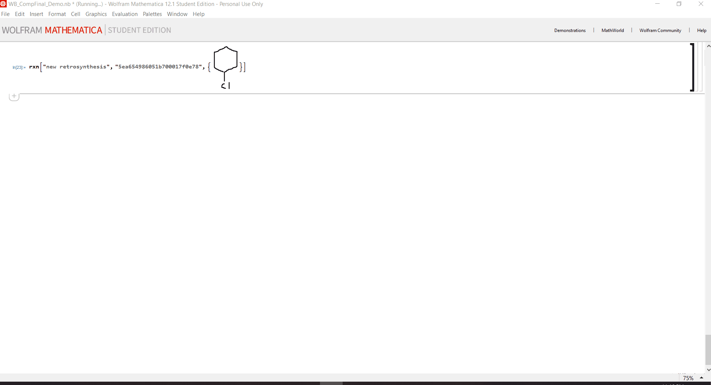

# IBM Rxn API Mathematica Wrapper

This API wrapper simplifies the use of IBM Rxn for chemistry capabilities in Mathematica.

## Background
[IBM's RXN for Chemistry AI](https://rxn.res.ibm.com/) allows for reaction product prediction given reactants or retrosynthetic prediction given a product. Its capabilities can be utilized in Mathematica through use of an API, however making requests and processing responses can be difficult. This wrapper acts to simplify the use of RXN for Chemistry by streamlining API requests and responses. 

## Live Demo


## Installation

Download the source code from the IBMRxn_RawCode file or IBMRxn_wDemo for the code plus a demonstration of its uses. 


## Usage
To utilize the API with your own account you will need to input your authorization key. You can find it in your IBM Rxn for chemistry profile under "Api Key." You will be prompted to enter your key upon first run of the wrapper code.

All calls to the function are formatted with a string request specifying the action you would like to do, followed by the requisite inputs specified in the table above:
```bash
rxn["request", input___] 
```

Below you will find a table outlining the capabilities of the function along with the necessary input and input types for each action. Note that inputs in italic characters are optional. 
Request | Action | Inputs | Input Type 
------- | ------ | -------| ---------- 
new project | Creates a new project. | Request, Project Name | String, String
new prediction | Creates a new prediction. | Request, Reactants List, Project ID | String, List of Images/Strings, String
new retrosynthesis| Creates a new retrosynthesis. | Request, Project ID, Product Molecule List, _Precursor SMILES_, _Output Type_ | String, String, List of Image/String, _String_, _String_
more predictions | Gets all predictions for a previous prediction. | Request, Project ID, Prediction ID | String, String, String
recover prediction | Recovers the results from a previous prediction. | Request, Prediction ID | String, String
recover retrosynthesis | Recovers the results from a previous retrosynthesis. | Request, Retrosynthesis ID, _Output Type_ | String, String, _String_
stored projects | Lists all stored projects, with project IDs. | Request | String
all project attempts | Lists all attempts within a project. | Request, Project ID | String, String
queue status | Gets retrosynthesis queue status information. | Request | String

Output Types | Format 
------------ | ------
default | Reaction Image and Prediction Information Table
dataset | Dataset of SMILES, Reaction Type, and Prediction Information 

Prediction or retrosynthesis requests can take lists of either SMILES strings, molecule images, or a mixture of both.
## Support
Any support related inquiries may be directed to wborrelli@fordham.edu. For general IBM RXN for Chemistry API support see [the official documentation](https://rxn.res.ibm.com/wp-content/uploads/2020/04/ibm_rxn_api_v2.pdf).

## Authors and Acknowledgement
Dr. Joshua Schrier, Kim B. and Stephen E. Bepler Chair Professor of Chemistry at Fordham University, was immensely helpful in all aspects of this project. 
